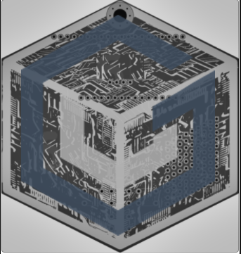
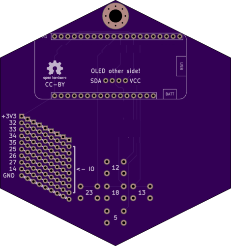

# VGS IOT Demo Hardware Badge

#### (Based off the CactusCon Badge 2017)        
[Cactus Con Badge 2017](https://github.com/thatch/cactuscon-badge-2017)

### This bage is created with KiKad     
[http://kicad-pcb.org/](http://kicad-pcb.org/)

     
**Front**
  
    
**Back**  

[Code for ES MCU](https://github.com/gjyoung1974/vgs_iot_demo)   

What can this badge do?     
With a NodeMCU we can read many sensor inputs, GPS data, etc.
- With the VGS Demo we can securely store sensor data streams within in our backend service
- We can also securely share data with other nodes within a sensor network 

```
2018 gjyoung1974
```

